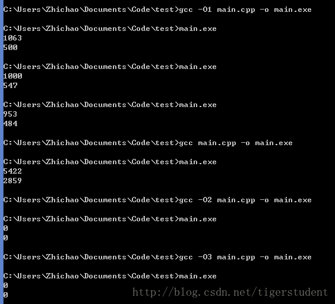

在今天早上嵌入式课上的课前演示中，我提到了循环求和中的优化（其实那只是前一天我网上搜索做准备时无意碰到的）。演示中我举的例程如下：

```C++
int sum = 0;
for (int i = 0; i &lt; 100; i++)
{
    sum += array[i];
}

int sum1 = 0, sum2 = 0;
for (int i = 0; i &lt; 100; i += 2)
{
    sum1 += array[i];
    sum2 += array[i + 1];
}

int sum = sum1 + sum2;
```

当时在网上看到的结论是，第二种方法更优，原因有二：

- 循环体中两个不相关的运算可以得到并行处理，减少运行时间
- 循环次数（从汇编的层次上讲就是条件跳转），其次数减少，因为条件跳转只有到最后一刻才知道代码会跳往何处。

演示完后，被老师问到，第二种方法能得到多大的优化，你测试过这代码吗？

悻悻地回答，没有。

于是回来之后我用更大的循环次数去测试验证了一下，代码一如下：

```C++
#include <windows.h>
#include <cstdio>
int main()
{
    DWORD start_time,end_time;
    int sum,i;

    start_time=GetTickCount();
    sum=0;
    for(i=0;i<1000000000;i++)
        sum+=i;
    end_time=GetTickCount();
    printf("%d\n",end_time-start_time);

    sum=0;
    int sum2=0,sum3=0;
    start_time=GetTickCount();
    for(int i=0;i<1000000000;i+=2)
        sum2+=i,sum3+=i+1;
    sum=sum2+sum3;
    end_time=GetTickCount();
    printf("%d\n",end_time-start_time);
}
```

运行结果：

```
5594
3328
```

由此可见，第二种方法确实能得到可观的性能优化。那么，现在剩下的问题是，到底是第一个原因起的作用大，还是第二个原因？

我把第二种方法的代码修改了，代码二如下：

```C++
    sum=0;
    start_time=GetTickCount();
    for(int i=0;i<1000000000;i+=2)
        sum+=i+i+1;
    end_time=GetTickCount();
    printf("%d\n",end_time-start_time);
```

运行结果：

```
5422
2953
```

经常多次测试表明，代码二确实比代码一里的第二种方法明显快上一点。因此，我个人感觉其中没有用到并行处理优化。也就是说，**在特定的情况下，通过减少条件跳转次数，可以获得可观的性能优化。**

下面我尝试进行`-O`编译优化。结果如下：



`-O1`优化居然能减少这么多时间！不过可能是这段代码逻辑太简单了。另外不知道为什么`-O2`优化后的运行结果不正常。。。有知道原因的童鞋请多多指教！