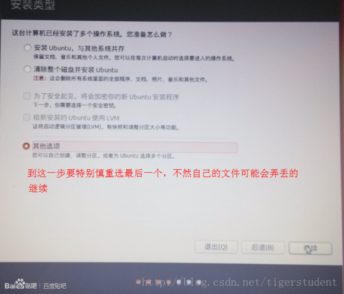

## 瞎扯在前

----------

笔记本刚买不久就想装ubuntu来着，但结果发现BIOS启动方式为UEFI，网上一搜索发现跟以前的双系统安装方法不一样，看具体教程感觉相当复杂，而且也有点担心折腾跪了这新本本所以一直没有动手。但昨天又心血来潮，看了几个教程后于是决定开搞！虽然中间不是很顺利，但最后结果发现也没有多复杂。

>环境：我的笔记本型号是戴尔Insprion 14R-5437,系统为原装Win8.1，BIOS启动方式为UEFI。用事先制作的启动U盘，安装的是Ubuntu14.04 64位。

**本文不是完整教程，所以建议参阅结合网上别的教程来操作。**

## 过程

----------

1. 在安装步骤开始前，当然得先分出一部分空闲空间。建议是从硬盘上最后一个分区分割出足够的空间，不用分区格式化，留着它空白就行。这里可以使用分区助手解决。

1. 首先当然得到BIOS设置下关闭罪恶之源——**secure boot**。但是每个机型的BIOS设置都不相同，所以自己发挥吧。

1. 重启电脑按F12进入启动设备选择。我选的是UEFI方式启动的U盘。

1. 进入安装程序后，一路直走到达安装方式的选择画面（类似下图，仅供参考）。我到达这画面时，它并没有检测出我硬盘上的win8.1来，所以我选择了最后一项，“其他选项”。

1. 分配空间。主要有两部分：a）点+，然后选大小（记得留swap的空间），选主分区，ext4格式，从起始点开始，选挂载到 / ，这空间就代表以后ubuntu系统能使用的空间大小。b）剩下的空间（4G-8G，一般不小于你的内存大小，步骤类&#20284;上面），新建一个swap分区：选大小，选逻辑分区，从起始点开始，挂载到swap。这里 / 下包含了/boot，/home，/opt等等，也有人为这几个单独建立分区也是可以的，不过我建议等你懂了之后下次再试吧。在此页面上你应该能找到一个efi分区，它就是UEFI的启动文件存放的地方。

1. 完成以上步骤就可以开始安装了，nothing more。
1. 完成ubuntu的安装后，重启电脑，能看到双系统选择画面，就代表双系统安装成功了。

## 结束语

----------

一开始我是用`ubuntu12.04.2` 64位来尝试的，但在第四步分配完空间进入下一步之后总是提示什么无法安装到/target。后来下了14.04才成功了。

以上是我亲测的安装过程，不代表别的机型也能按此成功，不过程序猿那颗敢于折腾的心不能丢啊

ps:话说回来，以前都是在低配置的机器上玩ubuntu，这次在新本子上运行真心流畅舒服!
